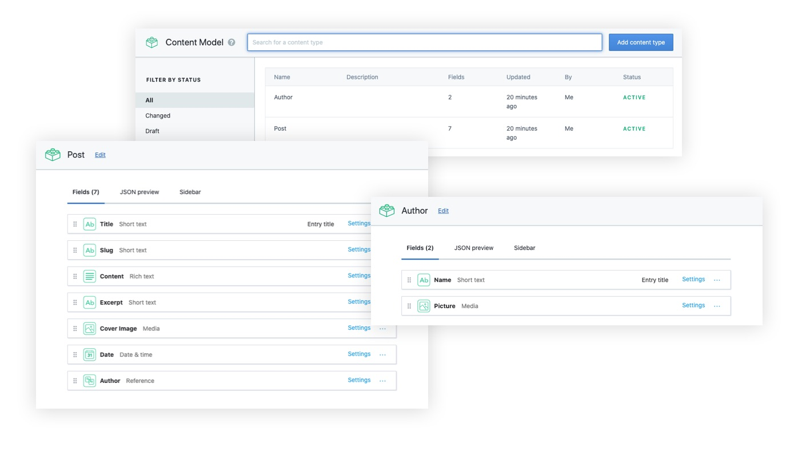
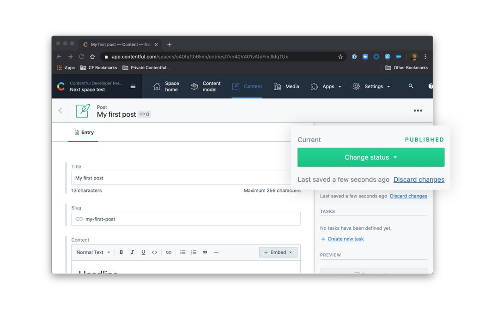
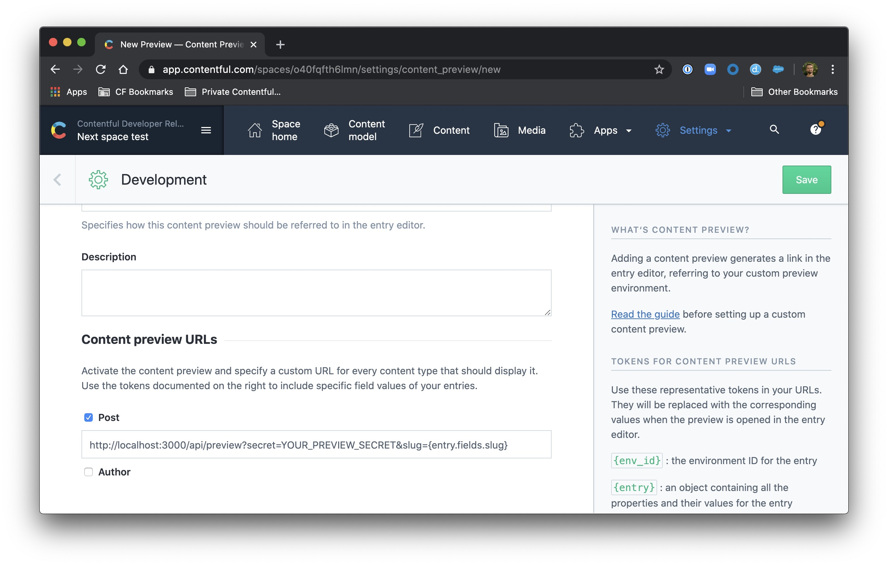
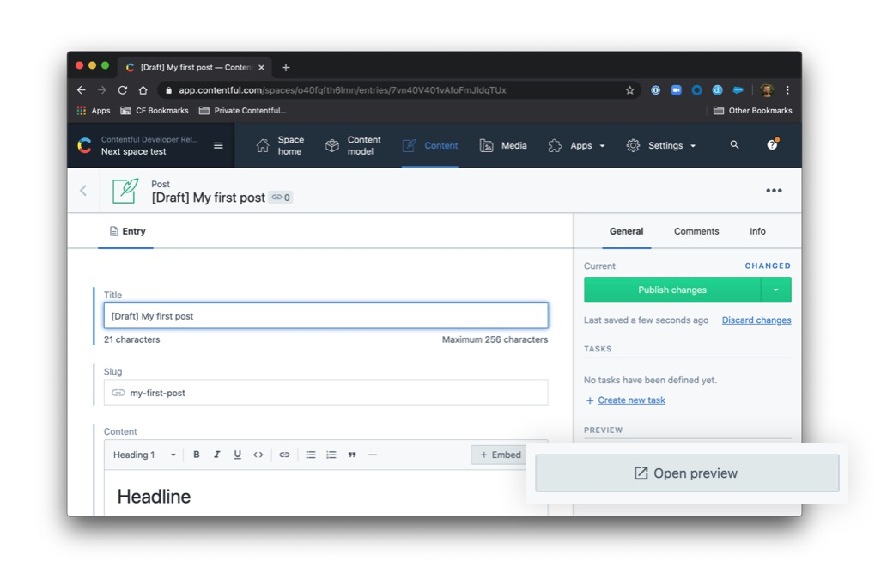

# A statically generated blog example using Next.js and Contentful

This example showcases Next.js's [Static Generation](/docs/basic-features/pages.md) feature using [Contentful](https://www.contentful.com/) as the data source.

## Demo

### [https://next-blog-contentful.now.sh/](https://next-blog-contentful.now.sh/)

### Related examples

- [Blog Starter](/examples/blog-starter)
- [DatoCMS](/examples/cms-datocms)
- [Prismic](/examples/cms-prismic)
- [TakeShape](/examples/cms-takeshape)
- [Sanity](/examples/cms-sanity)

## How to use

Execute [`create-next-app`](https://github.com/vercel/next.js/tree/canary/packages/create-next-app) with [npm](https://docs.npmjs.com/cli/init) or [Yarn](https://yarnpkg.com/lang/en/docs/cli/create/) to bootstrap the example:

```bash
npx create-next-app --example cms-contentful cms-contentful-app
# or
yarn create next-app --example cms-contentful cms-contentful-app
```

## Configuration

### Step 1. Create an account and a space on Contentful

First, [create an account on Contentful](https://www.contentful.com/sign-up/).

After creating an account, create a new empty **space** from the [dashboard](https://app.contentful.com/) and assign to it any name of your liking.

### Step 2. Create a content model

The [content model](https://www.contentful.com/developers/docs/concepts/data-model/) defines the data structures of your application/websites. The structures are flexible and you can tailor them to your needs.

For this example you need to create a content model that defines an author and a post content type. **You can create these two by running a script or by doing it manually** to familiarize yourself with the Contentful user interface.

#### Run a script to create the content model

This project includes a setup script which you can use to set up the content model expected by the source code.

In your Contentful dashboard go to **Settings > General Settings** and copy the **Space ID**.

Next, go to **Settings > API > Content management tokens** and create a new token by clicking **Generate personal token**. This token has the same access rights as the logged in user. **Do not share it publicly**, you will only use it to set up your space and can delete it afterwards.

With the space ID and management access token at hand run the following command:

```
npx cross-env CONTENTFUL_SPACE_ID=YOUR_SPACE_ID CONTENTFUL_MANAGEMENT_TOKEN=XXX npm run setup
```

This command will create the needed content structures and set up your Contentful space ready to use. The output should look as follows:

```
> cms-contentful@1.0.0 setup /Users/stefan.judis/Projects/next.js/examples/cms-contentful
> node ./contentful/setup.js $CONTENTFUL_SPACE_ID $CONTENTFUL_MANAGEMENT_TOKEN

┌──────────────────────────────────────────────────┐
│ The following entities are going to be imported: │
├─────────────────────────────────┬────────────────┤
│ Content Types                   │ 2              │
├─────────────────────────────────┼────────────────┤
│ Editor Interfaces               │ 2              │
├─────────────────────────────────┼────────────────┤
│ Locales                         │ 1              │
├─────────────────────────────────┼────────────────┤
│ Webhooks                        │ 0              │
├─────────────────────────────────┼────────────────┤
│ Entries                         │ 0              │
├─────────────────────────────────┼────────────────┤
│ Assets                          │ 0              │
└─────────────────────────────────┴────────────────┘
 ✔ Validating content-file
 ✔ Initialize client (1s)
 ✔ Checking if destination space already has any content and retrieving it (2s)
 ✔ Apply transformations to source data (1s)
 ✔ Push content to destination space
   ✔ Connecting to space (1s)
   ...
   ...
   ...
```

#### Create the content model manually

##### Create an `Author` content type

From your contentful space, go to **Content model** and add a new content type:

- Give it the **Name** `Author`, the **Api Identifier** should be `author`

Once the content model is saved, add these fields (you don't have to modify the settings unless specified):

- `name` - **Text** field (type **short text**). **Field ID** should be set to `name`
- `picture` - **Media** field (type **one file**). **Field ID** should be set to `picture`

Save the content type and continue.

##### Create a `post` type

From your contentful space, go to **Content model** and add another content type:

- Give it the **Name** `Post`, the **Api Identifier** should be `post`

Next, add these fields (you don't have to modify the settings unless specified):

- `title` - **Text** field (type **short text**)
- `content` - **Rich text** field
- `excerpt` - **Text** field (type **Long text, full-text search**)
- `coverImage` - **Media** field (type **one file**)
- `date` - **Date and time** field
- `slug` - **Text** field. You can optionally go to the settings of this field, and under **Appearance**, select **Slug** to display it as a slug of the `title` field.
- `author` - **Reference** field (type **one reference**)

Save the content type and continue.

### Step 3. Validate your content model

After setting up the content model (either manually or by running `npm run setup` or `yarn setup`), it should look as follows.

**Content model overview**



### Step 4. Populate Content

Go to the **Content** section in your space, then click on **Add entry** and select the **Author** content type:

- You just need **1 author entry**.
- Use dummy data for the text.
- For the image, you can download one from [Unsplash](https://unsplash.com/).

Next, create another entry with the content type **Post**:

- We recommend creating at least **2 post entries**.
- Use dummy data for the text.
- For images, you can download them from [Unsplash](https://unsplash.com/).
- Pick the **author** you created earlier.

**Important:** For each entry and asset, you need to click on **Publish**. If not, the entry will be in draft state.



### Step 5. Set up environment variables

From your contentful space, go to **Settings > API keys**. There will be an example Content delivery / preview token - you can use these API keys. (You may also create a new key.)

Next, copy the `.env.example` file in this directory to `.env` (which will be ignored by Git):

```bash
cp .env.example .env
```

Then set each variable on `.env`:

- `NEXT_EXAMPLE_CMS_CONTENTFUL_SPACE_ID` should be the **Space ID** field of your API Key
- `NEXT_EXAMPLE_CMS_CONTENTFUL_ACCESS_TOKEN` should be the **[Content Delivery API](https://www.contentful.com/developers/docs/references/content-delivery-api/) - access token** field of your API key
- `NEXT_EXAMPLE_CMS_CONTENTFUL_PREVIEW_ACCESS_TOKEN` should be the **[Content Preview API](https://www.contentful.com/developers/docs/references/content-preview-api/) - access token** field of your API key
- `NEXT_EXAMPLE_CMS_CONTENTFUL_PREVIEW_SECRET` should be any value you want. It must be URL friendly as the dashboard will send it as a query parameter to enable preview mode

Your `.env` file should look like this:

```bash
NEXT_EXAMPLE_CMS_CONTENTFUL_SPACE_ID=...
NEXT_EXAMPLE_CMS_CONTENTFUL_ACCESS_TOKEN=...
NEXT_EXAMPLE_CMS_CONTENTFUL_PREVIEW_ACCESS_TOKEN=...
NEXT_EXAMPLE_CMS_CONTENTFUL_PREVIEW_SECRET=...
```

### Step 6. Run Next.js in development mode

```bash
npm install
npm run dev

# or

yarn install
yarn dev
```

Your blog should be up and running on [http://localhost:3000](http://localhost:3000)! If it doesn't work, post on [GitHub discussions](https://github.com/vercel/next.js/discussions).

### Step 7. Try preview mode

In your Contentful space, go to **Settings > Content preview** and add a new content preview for development.

The **Name** field may be anything, like `Development`. Then, under **Content preview URLs**, check **Post** and set its value to:

```
http://localhost:3000/api/preview?secret=<NEXT_EXAMPLE_CMS_CONTENTFUL_PREVIEW_SECRET>&slug={entry.fields.slug}
```

Replace `<NEXT_EXAMPLE_CMS_CONTENTFUL_PREVIEW_SECRET>` with its respective value in `.env`.



Once saved, go to one of the posts you've created and:

- **Update the title**. For example, you can add `[Draft]` in front of the title.
- The state of the post will switch to **CHANGED** automatically. **Do not** publish it. By doing this, the post will be in draft state.
- In the sidebar, you will see the **Open preview** button. Click on it!



You will now be able to see the updated title. To exit preview mode, you can click on **Click here to exit preview mode** at the top of the page.

### Step 8. Deploy on Vercel

You can deploy this app to the cloud with [Vercel](https://vercel.com/import?filter=next.js&utm_source=github&utm_medium=readme&utm_campaign=next-example) ([Documentation](https://nextjs.org/docs/deployment)).

To deploy on Vercel, you need to set the environment variables with **Now Secrets** using [Vercel CLI](https://vercel.com/download) ([Documentation](https://vercel.com/docs/now-cli#commands/secrets)).

Install [Vercel CLI](https://vercel.com/download), log in to your account from the CLI, and run the following commands to add the environment variables. Replace each variable with the corresponding strings in `.env`:

```bash
now secrets add next_example_contentful_space_id <NEXT_EXAMPLE_CMS_CONTENTFUL_SPACE_ID>
now secrets add next_example_cms_contentful_access_token <NEXT_EXAMPLE_CMS_CONTENTFUL_ACCESS_TOKEN>
now secrets add next_example_cms_contentful_preview_access_token <NEXT_EXAMPLE_CMS_CONTENTFUL_PREVIEW_ACCESS_TOKEN>
now secrets add next_example_cms_contentful_preview_secret <NEXT_EXAMPLE_CMS_CONTENTFUL_PREVIEW_SECRET>
```

Then push the project to GitHub/GitLab/Bitbucket and [import to Vercel](https://vercel.com/import?filter=next.js&utm_source=github&utm_medium=readme&utm_campaign=next-example) to deploy.
